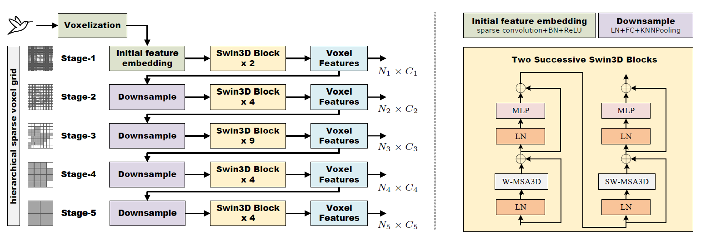

# Swin3D: A Pretrained Transformer Backbone for 3D Indoor Scene Understanding

[](https://paperswithcode.com/sota/semantic-segmentation-on-scannet?p=swin3d-a-pretrained-transformer-backbone-for)
[](https://paperswithcode.com/sota/semantic-segmentation-on-s3dis-area5?p=swin3d-a-pretrained-transformer-backbone-for)
[](https://paperswithcode.com/sota/semantic-segmentation-on-s3dis?p=swin3d-a-pretrained-transformer-backbone-for)
[](https://paperswithcode.com/sota/3d-object-detection-on-scannetv2?p=swin3d-a-pretrained-transformer-backbone-for)
[](https://paperswithcode.com/sota/3d-object-detection-on-s3dis?p=swin3d-a-pretrained-transformer-backbone-for)

## Updates

***27/04/2023***

Initial commits:

1. Pretrained models on Structured3D are provided.
2. The supported code for Semantic Segmentation on ScanNet and S3DIS are provided.

## Introduction

We present a pretrained 3D backbone, named Swin3D, that first-time outperforms all state-of-the-art methods on downstream 3D indoor scene understanding tasks. Our backbone network is based on a 3D Swin transformer and carefully designed for efficiently conducting self-attention on sparse voxels with a linear memory complexity and capturing the irregularity of point signals via generalized contextual relative positional embedding. Based on this backbone design, we pretrained a large Swin3D model on a synthetic Structured3D dataset that is 10 times larger than the ScanNet dataset and fine-tuned the pretrained model on various downstream real-world indoor scene understanding tasks.



## Overview

- [Data Preparation](#data-preparation)
- [Pretrained Models](#pretrained-models)
- [Quick Start](#quick-start)
- [Results and models](#results-and-models)
- [Citation](#citation)

## Data Preparation

We pretrained our Swin3D on Structured3D, please refer to this [link](https://github.com/yuxiaoguo/Uni3DScenes) to prepare the data.

## Pretrained Models

The models pretrained on Structured3D with different cRSE are provided here.

|          |   Pretrain   | #params | cRSE         | mIoU(val) |                                            Model                                            |                                            Log                                            |
| :------- | :----------: | :------ | :----------- | :-------: | :-----------------------------------------------------------------------------------------: | :---------------------------------------------------------------------------------------: |
| Swin3D-S | Structured3D | 23.57M  | XYZ,RGB      |   77.69   | [model](https://drive.google.com/file/d/1oezNkN3_HZvyxGxjtOpSaQUbGl3YYF90/view?usp=sharing) | [log](https://drive.google.com/file/d/1TuwZqpKm8OYj8BeMhDUhLcGqzXhgJcpC/view?usp=sharing) |
| Swin3D-S | Structured3D | 23.57M  | XYZ,RGB,NORM |   79.15   | [model](https://drive.google.com/file/d/1FMmAgHwS__NtFldH-lFTsraKj0my62t4/view?usp=sharing) | [log](https://drive.google.com/file/d/1-0kz81X0j2Zp-mntN1GwQlsm5sLIy3JX/view?usp=sharing) |
| Swin3D-L | Structured3D | 60.75M  | XYZ,RGB      |   79.79   | [model](https://drive.google.com/file/d/1ior8uAQRiVd2mwfYapcaF_e_R80y7DQm/view?usp=sharing) | [log](https://drive.google.com/file/d/1YYd8SOaAIqz16T7XOL54aGPC4sSoMXsW/view?usp=sharing) |
| Swin3D-L | Structured3D | 60.75M  | XYZ,RGB,NORM |   81.04   | [model](https://drive.google.com/file/d/1ySNrP39H6m-euK-2La60-MNOp0e3Pe_4/view?usp=sharing) | [log](https://drive.google.com/file/d/1nXQCw5G2swrSksBnpGBveNSHwAqy8hAZ/view?usp=sharing) |

## Quick Start

Install the package using 

    pip install -r requirements.txt
    python setup.py install

Build models and load our pretrained weight, Then you can finetune your model in various task.

    import torch
    from Swin3D.models import Swin3DUNet
    model = Swin3DUNet(depths, channels, num_heads, \
            window_sizes, quant_size, up_k=up_k, \
            drop_path_rate=drop_path_rate, num_classes=num_classes, \
            num_layers=num_layers, stem_transformer=stem_transformer, \
            upsample=upsample, first_down_stride=down_stride, \
            knn_down=knn_down, in_channels=in_channels, \
            cRSE='XYZ_RGB_NORM', fp16_mode=1)
    model.load_pretrained_model(ckpt_path)

## Results and models

To reproduce our results on downstream tasks, please follow the code in this [repo](https://github.com/Yukichiii/Swin3D_Task). The results are provided here.

### ScanNet Segmentation

|          | Pretrained | mIoU(Val)  | mIoU(Test) |
| :------- | :--------: | :--------: | :--------: |
| Swin3D-S |  &cross;   |    75.2    |     -      |
| Swin3D-S |  &check;   | 75.6(76.8) |     -      |
| Swin3D-L |  &check;   | 76.2(77.5) |    77.9    |

### S3DIS Segmentation

|          | Pretrained | Area 5 mIoU | 6-fold mIoU |
| :------- | :--------: | :---------: | :---------: |
| Swin3D-S |  &cross;   |    72.5     |    76.9     |
| Swin3D-S |  &check;   |    73.0     |    78.2     |
| Swin3D-L |  &check;   |    74.5     |    79.8     |

### ScanNet 3D Detection

|                    | Pretrained | mAP@0.25 | mAP@0.50 |
| :----------------- | :--------: | :------: | :------: |
| Swin3D-S+FCAF3D    |  &check;   |   74.2   |   59.5   |
| Swin3D-L+FCAF3D    |  &check;   |   74.2   |   58.6   |
| Swin3D-S+CAGroup3D |  &check;   |   76.4   |   62.7   |
| Swin3D-L+CAGroup3D |  &check;   |   76.4   |   63.2   |

### S3DIS 3D Detection

|                 | Pretrained | mAP@0.25 | mAP@0.50 |
| :-------------- | :--------: | :------: | :------: |
| Swin3D-S+FCAF3D |  &check;   |   69.9   |   50.2   |
| Swin3D-L+FCAF3D |  &check;   |   72.1   |   54.0   |

## Citation

If you find Swin3D useful to your research, please cite our work:

```
@misc{yang2023swin3d,
      title={Swin3D: A Pretrained Transformer Backbone for 3D Indoor Scene Understanding}, 
      author={Yu-Qi Yang and Yu-Xiao Guo and Jian-Yu Xiong and Yang Liu and Hao Pan and Peng-Shuai Wang and Xin Tong and Baining Guo},
      year={2023},
      eprint={2304.06906},
      archivePrefix={arXiv},
      primaryClass={cs.CV}
}
```
